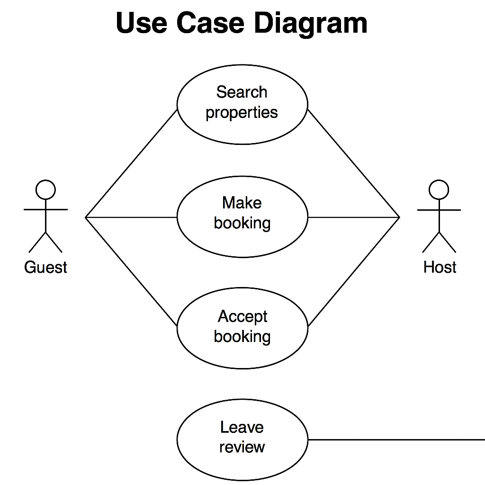

# 📘 Requirement Analysis in Software Development

## 🔍 Introduction

Welcome to the **Requirement Analysis** repository!  
This project is part of the ALX Frontend Curriculum and focuses on the foundation of software development — understanding what a system should do **before** building it.

Through this repository, you'll explore the critical processes of **Requirement Analysis**, understand its significance in the **Software Development Lifecycle (SDLC)**, and apply practical tools like **Use Case Diagrams** to model software behavior.

---

## 🧠 What is Requirement Analysis?

**Requirement Analysis** is the process of identifying, documenting, and validating the needs and expectations of stakeholders for a new or modified software application.

It serves as a blueprint for development teams to:
- Understand **what needs to be built**
- Avoid unnecessary features
- Deliver what the client actually wants

Requirement Analysis plays a vital role in:
- Reducing rework and cost
- Enhancing software quality
- Ensuring project success

It’s typically one of the **first steps in the SDLC**, laying the groundwork for system design, implementation, testing, and deployment.

---

## 💡 Why is Requirement Analysis Important?

1. **Prevents Miscommunication**
   - Clearly defines what the client expects vs. what the team will build.
   - Avoids assumptions and aligns everyone’s understanding.

2. **Reduces Project Risk and Rework**
   - Identifies issues early in the lifecycle, saving time and resources.
   - Helps prioritize features based on user needs.

3. **Improves System Quality**
   - Ensures that all requirements are testable and traceable.
   - Leads to better system performance and customer satisfaction.

---

## 🛠️ Key Activities in Requirement Analysis

- **🔍 Requirement Gathering**
  - Collect raw information from stakeholders, users, clients, etc.

- **🗣️ Requirement Elicitation**
  - Use interviews, surveys, observation, and brainstorming to refine needs.

- **📝 Requirement Documentation**
  - Structure the gathered information into Software Requirements Specifications (SRS).

- **🧩 Requirement Analysis and Modeling**
  - Organize and break down requirements to detect conflicts, gaps, or overlaps.

- **✅ Requirement Validation**
  - Confirm that requirements are correct, complete, and aligned with user needs.

---

## 📂 Types of Requirements

### ✅ Functional Requirements

These describe **what the system should do**.

**Examples (Booking Management System):**
- Users can create accounts and log in.
- Hosts can list properties with descriptions and prices.
- Guests can book properties and receive confirmation emails.

### ⚙️ Non-functional Requirements

These define **how the system performs** under various conditions.

**Examples (Booking Management System):**
- The system should respond within 2 seconds for 95% of requests.
- The application must support 10,000 concurrent users.
- All user data must be encrypted and comply with GDPR.

---

## 🎭 Use Case Diagrams

### 📌 What are Use Case Diagrams?

Use Case Diagrams visually represent **actors** (users or systems) and their **interactions** with system functions (use cases). They help stakeholders understand:
- System boundaries
- User roles
- Functional requirements at a high level

### 🧪 Benefits:
- Easy to understand and explain to non-technical stakeholders
- Helps uncover functional requirements early
- Great for planning user stories and test cases

### 🖼️ ALX Booking Use Case Diagram

---

## ✅ Acceptance Criteria

**Acceptance Criteria** define the **conditions** a feature must meet to be accepted by stakeholders. They serve as:
- A checklist to verify implementation
- A tool to drive testing and validation
- A shared understanding between devs and product owners

### Example – Checkout Feature (Booking System)

> ✅ **Acceptance Criteria for Checkout:**
- The user must be logged in.
- The user must have selected a property and booking dates.
- The system must display a total cost breakdown.
- The system must validate card/payment method before proceeding.
- The user receives a booking confirmation email upon successful checkout.

---

> “Requirement Analysis is the bridge between an idea and a solution.”

